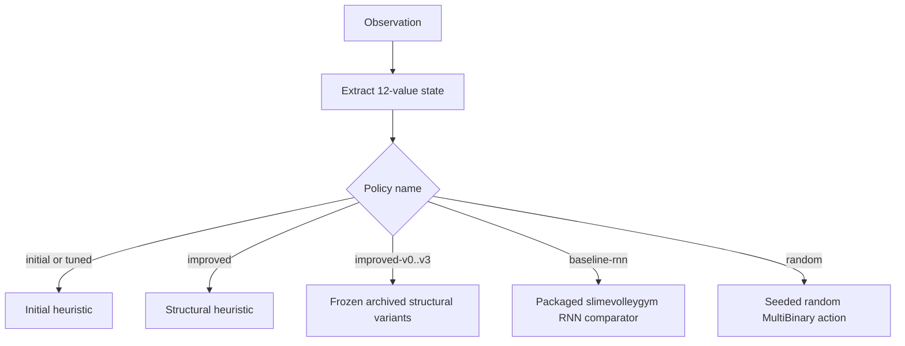
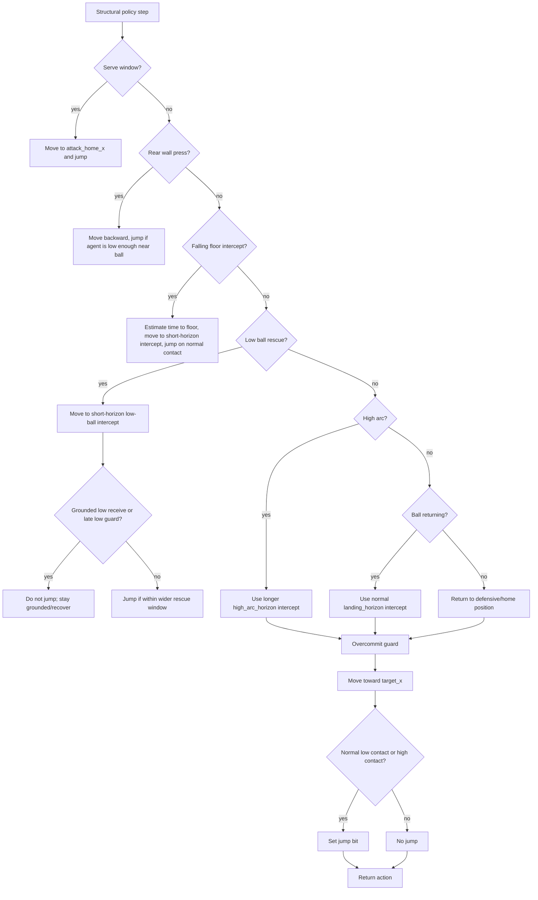
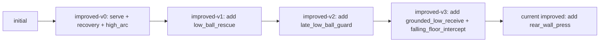

# SlimeVolley Heuristic Logic Visual

This report visualizes the current transparent SlimeVolley heuristic in
`hl_benchmark/policies/slimevolley.py`. It covers the active `improved` policy,
not the packaged `baseline-rnn` comparator.

## Observation And Action Map

Observation values are agent-relative and normalized by the environment:

| Slice | Meaning |
| --- | --- |
| `obs[0:4]` | agent `x, y, vx, vy` |
| `obs[4:8]` | ball `x, y, vx, vy` |
| `obs[8:12]` | opponent `x, y, vx, vy` |

Actions are MultiBinary controls:

| Action | Meaning |
| --- | --- |
| `[1, 0, 0]` | move forward |
| `[0, 1, 0]` | move backward |
| `[0, 0, 1]` | jump only |
| movement plus jump | move and jump together |

## Top-Level Policy Switch



The current maintained heuristic is `improved`, which calls
`SlimeVolleyHeuristicPolicy(..., structural=True)`.

## Initial Heuristic

The initial policy is intentionally small:

```mermaid
flowchart TD
    A[Read x, ball_x, ball_y, ball_vx, ball_vy] --> B{Ball on our side or moving toward us?}
    B -->|yes| C[target_x = clip(ball_x + landing_horizon * ball_vx)]
    B -->|no| D[target_x = home_x]
    C --> E[Move toward target_x]
    D --> E
    E --> F{Ball near x, low/mid height, descending?}
    F -->|yes| G[Set jump bit]
    F -->|no| H[No jump]
    G --> I[Return action]
    H --> I
```

In words: predict a near-future ball x-position, move toward it, and jump only
when the ball is close enough, low enough, and descending.

## Current Improved Heuristic Priority Order

The active `improved` policy is a priority-ordered rule stack. Earlier modes
win; later modes only run if no earlier condition matched.



## Mode Cheat Sheet

| Priority | Mode | Trigger | Target/action | Intended behavior |
| ---: | --- | --- | --- | --- |
| 1 | `serve` | early steps, ball near center, ball high | move to `attack_home_x`, jump | start points aggressively |
| 2 | `rear_wall_press` | ball far right/rear, low, descending, agent also rear | move backward, maybe jump | handle rear-wall low losses found in diagnostics |
| 3 | `falling_floor_intercept` | ball on/near our side, mid-low, falling fast | estimate time to floor, intercept | catch fast drops before bounce/loss |
| 4 | `low_ball_rescue` | ball on our side, low, falling | short-horizon intercept | emergency low return |
| 4a | `grounded_low_receive` | low ball but agent is already above it | suppress jump | avoid mistimed airborne jumps |
| 4b | `late_low_ball_guard` | very late/low falling ball while agent is high | suppress jump | avoid wasting jump when it is too late |
| 5 | `high_arc` | ball above normal jump range and falling | longer-horizon intercept | prepare for high lob return |
| 6 | `ball_returning` | ball near our side or moving toward us | normal landing intercept | default receive behavior |
| 7 | `home/defensive recovery` | ball not returning | `defensive_home_x` or `home_x` | reset position and avoid overcommit |

## Movement Primitive

Every mode eventually chooses a target x-position, then uses the same movement
primitive:

```mermaid
flowchart LR
    A[target_x] --> B{x compared to target_x}
    B -->|x > target + margin| C[[1,0,0] forward]
    B -->|x < target - margin| D[[0,1,0] backward]
    B -->|inside margin| E[[0,0,0] no horizontal move]
    C --> F{jump?}
    D --> F
    E --> F
    F -->|yes| G[set action[2] = 1]
    F -->|no| H[keep action[2] = 0]
```

## What Changed Across Archived Policies



The evolution is structural, not just scalar tuning: each archive adds a named
detector or recovery mode that remains inspectable in code.

## Known Behavior From Current Evaluation

The current rules improve strongly against random and archived heuristic
opponents, but they still do not solve the built-in opponent.

| Matchup | Generation-3 holdout result |
| --- | --- |
| `improved` vs `random` | mean `4.00`, wins `50/50` |
| `improved` vs `initial` | mean `3.72`, wins `50/50` |
| `improved` vs `improved-v0` | mean `3.78`, wins `50/50` |
| `improved` vs `improved-v2` | mean `3.34`, wins `49/50` |
| `improved` vs `improved-v3` | mean `0.24`, wins `25/50`, draws `5/50` |
| `improved` vs `builtin` | mean `-3.68`, wins `0/50`, draws `2/50` |
| `baseline-rnn` vs `builtin` | mean `-0.26`, wins `12/50`, draws `20/50` |

Conclusion: the current heuristic has an interpretable improvement path and is
robust against the archived heuristic pool, but it remains far behind the
packaged RNN comparator on the built-in opponent.
